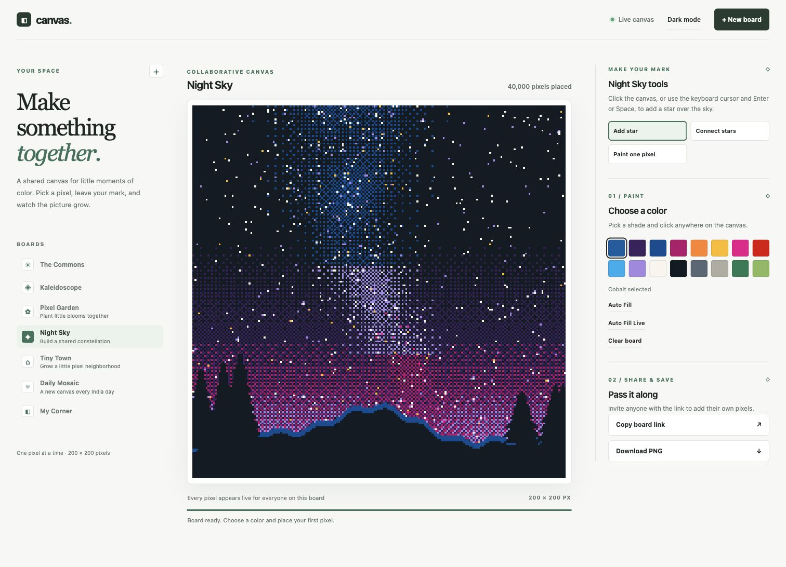
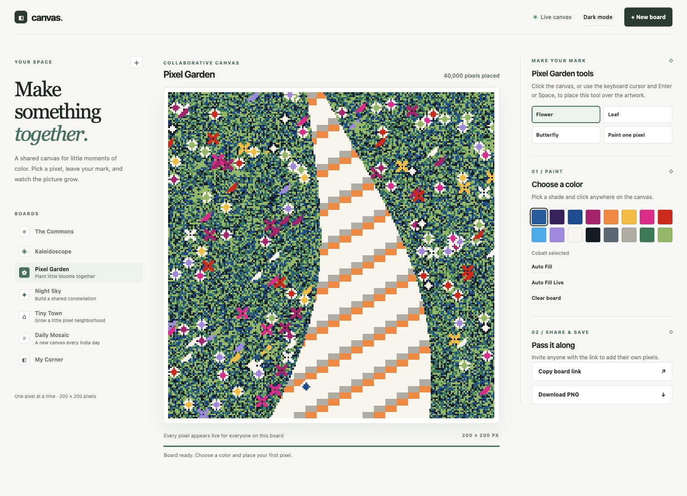
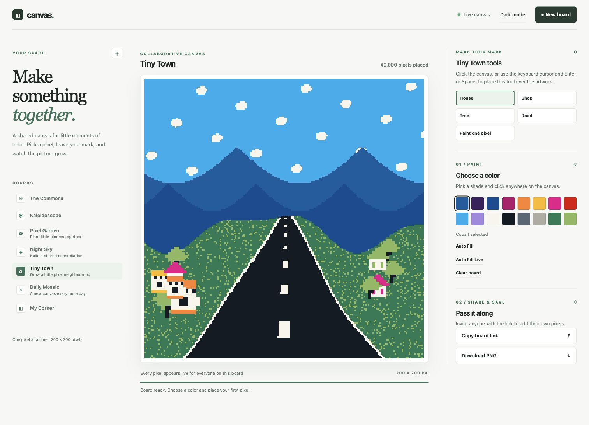
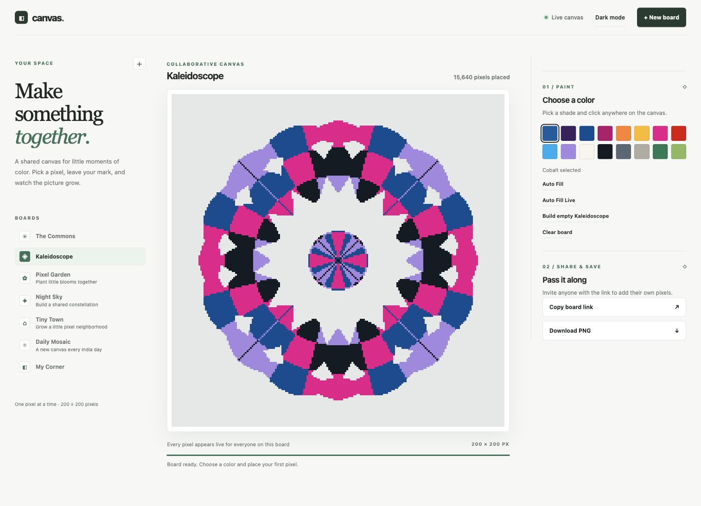
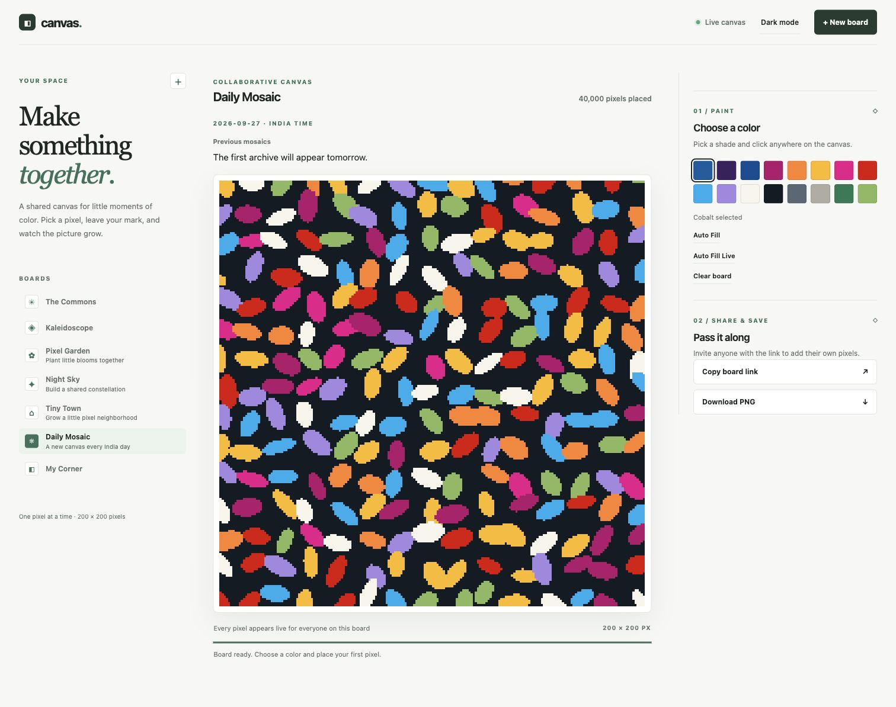

# Canvas

**A shared pixel art space where anyone on the same board can draw together.** Open [canvas.rishirajpal.com](https://canvas.rishirajpal.com), choose a board, pick a color, and make your mark. Changes appear live for other visitors.



*Live site screenshot, 27 September 2026. Shared boards can look different now.*

## Start drawing

1. Open the [live site](https://canvas.rishirajpal.com) and choose a board from the sidebar.
2. Choose a color, then click the canvas. On themed boards, select a special tool or **Paint one pixel** first.
3. Use **Auto Fill** to replace the board with new artwork immediately, or **Auto Fill Live** to reveal a new design one pixel at a time. Live filling keeps going if you switch boards or browser tabs. **Clear board** removes the paint.
4. Use **Copy board link** to invite someone, or **Download PNG** to save the current picture.

The canvas also supports keyboard drawing: use the arrow keys to choose a pixel and Enter or Space to paint it. Escape cancels the first point of a Night Sky line.

### Choose a board

| Board | What you can do | Lifetime |
| --- | --- | --- |
| [The Commons](https://canvas.rishirajpal.com/map) | Paint together on the shared open canvas. | Always available |
| [Kaleidoscope](https://canvas.rishirajpal.com/board/kaleidoscope) | Paint within a symmetric pattern, generate a new empty design, or fill it with random colors. | Always available |
| [Pixel Garden](https://canvas.rishirajpal.com/board/garden) | Place flowers, leaves, and butterflies over a colorful path. | Always available |
| [Night Sky](https://canvas.rishirajpal.com/board/night-sky) | Add stars and connect them over a night scene. | Always available |
| [Tiny Town](https://canvas.rishirajpal.com/board/tiny-town) | Place houses, shops, trees, and roads in a small landscape. | Always available |
| [Daily Mosaic](https://canvas.rishirajpal.com/board/daily) | Add to today's shared abstract artwork. | New board at midnight India time; today and six previous India dates remain available |
| Your board | Select **+ New board**, name it, and share its link. Only your own board offers photo upload or camera capture. | Editable for 168 hours, then deleted |

The themed tools can paint over existing pixels. Archived Daily Mosaics are viewable and downloadable but read only. All boards are collaborative: anyone who can open an editable board can change its pixels. There are no private board accounts or edit permissions.

### Live gallery

These are screenshots of the **running site**, captured on 27 September 2026. The artwork is shared and can change at any time.

| Pixel Garden | Tiny Town |
| --- | --- |
|  |  |

| Kaleidoscope | Daily Mosaic |
| --- | --- |
|  |  |

On a board you create, **Upload photo** or **Take photo** prepares a pixel preview. **Recreate photo on board** changes that board's size, clears its paint, and reveals the palette version live. The browser converts the photo locally; the original image file is not sent to the server. Photo tools do not appear on built-in boards. Large images are limited to 40,000 pixels and 512 pixels on either side.

## How it works

The production app has a static frontend on **Cloudflare Pages**. Pages Functions route page and API requests to a private **Cloudflare Worker**. The Worker coordinates boards through SQLite-backed **Durable Objects**. Visitors receive live updates through WebSockets. The local Go server uses the same browser assets, stores boards in files, and streams updates through server-sent events.

```text
Browser → Cloudflare Pages → Pages Functions → private Worker → Durable Objects
   ↕            static assets          API + live updates     board storage

Local development: Browser → Go server → data/ files
```

Each board has a generation number. Full-board actions advance it, so a delayed paint request from an older version cannot overwrite the new design. **Auto Fill Live** sends small batches while the browser reveals individual pixels. Kaleidoscope generation keeps its pattern symmetric.

Daily Mosaic changes at midnight **Asia/Kolkata**. Its older boards become read only, and boards older than seven India calendar days are deleted. User-created boards expire after exactly 168 hours. Built-in boards stay available. The production Cloudflare data is separate from local `data/` files, and redeploying does not reset it.

### Repository map

| Path | Purpose |
| --- | --- |
| `pages/` | Shared HTML, styles, browser logic, and browser tests. |
| `functions/` | Cloudflare Pages request routing. |
| `cloudflare/worker/` | Production API, board state, and Durable Objects. |
| `cloudflare/pages/` | Pages build and route checks. |
| `cmd/canvas/` and `internal/localserver/` | Local Go entry point and disk-backed server. |
| `assets/screenshots/` | Captures of the live interface used by this README. |
| `.github/workflows/deploy.yml` | Checks and automatic production deployment from `main`. |

### Run locally

Install **Go 1.22 or newer**, then run:

```sh
go run ./cmd/canvas
```

Open [localhost:8080](http://localhost:8080). The server binds to `127.0.0.1:8080` and stores boards in `data/` by default. Set `CANVAS_ADDR` or `CANVAS_DATA_DIR` to change those defaults:

```sh
CANVAS_ADDR=127.0.0.1:9090 CANVAS_DATA_DIR=/tmp/canvas-data go run ./cmd/canvas
```

The local server serves the same interface and API, but its board data does not sync with production. Camera capture requires browser permission and a secure context; localhost is treated as secure by modern browsers.

### API essentials

Board-specific routes accept `?board=<id>`; omitting it selects The Commons. Pixel IDs are `y * width + x`. A board snapshot contains its width, height, cells, and generation; `0` means blank, `1`–`16` are palette colors, and `-1` means outside a pattern.

| Request | Purpose |
| --- | --- |
| `GET /api/boards` | List available boards. |
| `POST /api/boards` | Create a named board. |
| `GET /api/map?board=<id>` | Read a board snapshot. |
| `POST /api/events?board=<id>` | Paint one pixel. |
| `POST /api/events/batch?board=<id>` | Paint 1–64 pixels. |
| `PUT /api/artwork?board=<id>` | Replace a board's artwork atomically. |
| `POST /api/clear?board=<id>` | Clear paint while keeping the board's shape. |
| `GET /api/daily/today` and `GET /api/daily/archive` | Find today's mosaic and retained archives. |

Most requests that replace a board include its current `generation`. A stale generation returns HTTP 409, so clients can reload before retrying. See the route handlers in `internal/localserver/` and `cloudflare/worker/` for the full request shapes.